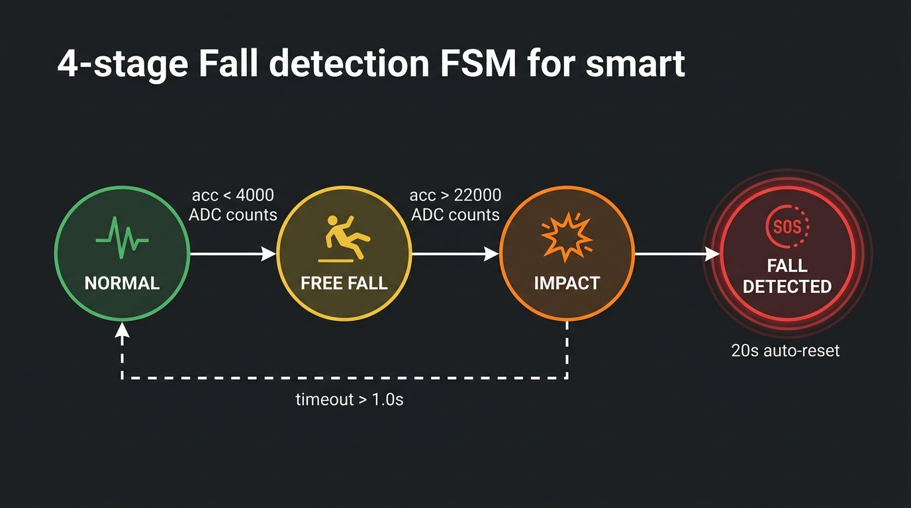
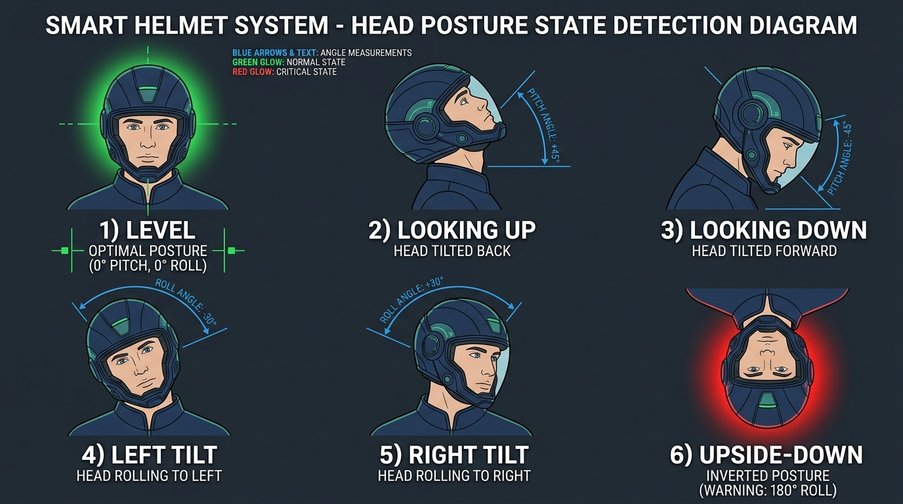
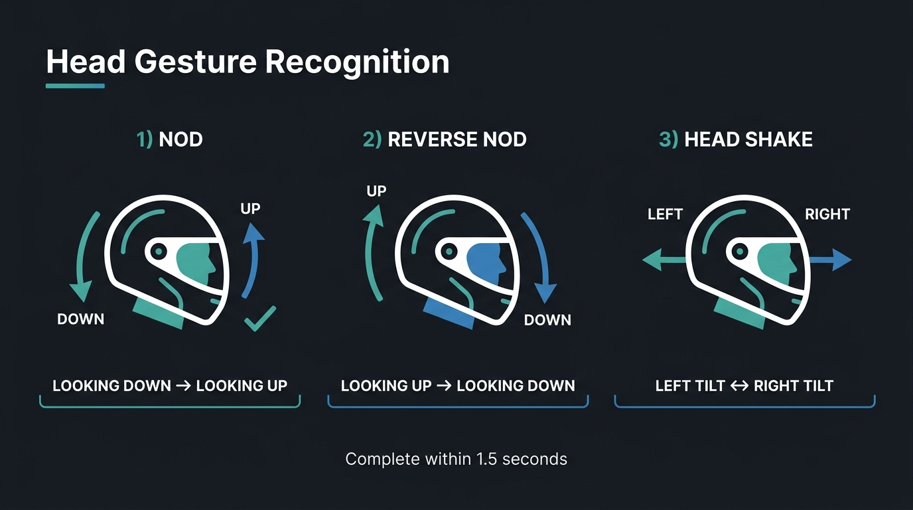
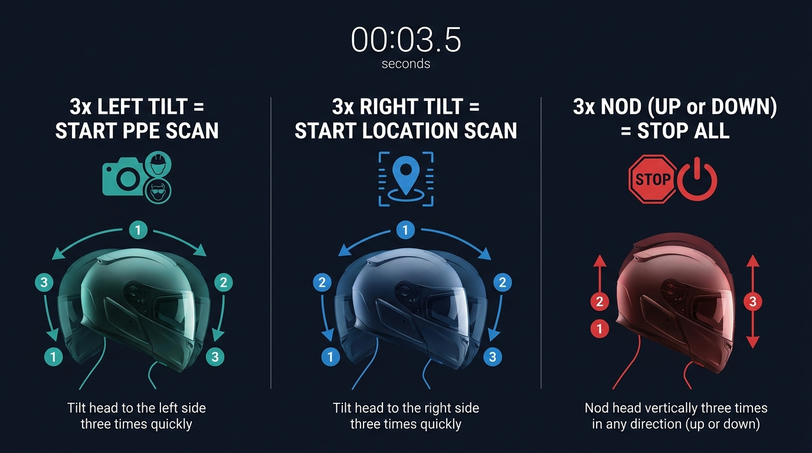

# 🪖 Smart Helmet — Integrated Safety & Telemetry System

> **An IoT-based wearable system for industrial worker safety monitoring.**  
> Combines a Raspberry Pi helmet unit with a custom Android app for real-time PPE inspection, head-gesture commands, fall detection, and GPS-tracked emergency SOS.

---

## 📑 Table of Contents

- [System Overview](#-system-overview)
- [Hardware Platform](#-hardware-platform)
- [Repository Structure](#-repository-structure)
- [Quick Start](#-quick-start)
- [Helmet Server (Python / Flask)](#-helmet-server-python--flask)
  - [IMU Telemetry & Posture Engine](#imu-telemetry--posture-engine)
  - [Camera & Video Streaming](#camera--video-streaming)
  - [Video Recording Pipeline](#video-recording-pipeline)
  - [Fall Detection Finite State Machine](#fall-detection-finite-state-machine)
  - [Barometric Altitude (BMP280)](#barometric-altitude-bmp280)
- [Android Application (Java)](#-android-application-java)
  - [Two-Stage PPE Detection Pipeline](#two-stage-ppe-detection-pipeline)
  - [YOLOv8 Model Training](#yolov8-model-training)
  - [PaddleOCR Live Location Scanner](#paddleocr-live-location-scanner)
  - [Emergency SOS System](#emergency-sos-system)
- [Posture States](#-posture-states)
- [Gesture Recognition](#-gesture-recognition)
- [Hands-Free Head Commands](#-hands-free-head-commands)
- [REST API Reference](#-rest-api-reference)
- [Android Permissions](#-android-permissions)

---

## 🌐 System Overview

```
┌──────────────────────────────────┐        Wi-Fi / HTTP :5000
│     RASPBERRY PI ZERO 2 W        │ ─────────────────────────────▶  Android App
│                                  │
│  Sony IMX708 (12MP)  ─ MJPEG ──▶ │  /video     → Live camera stream
│  MPU6050 (IMU)  ─── I2C 0x68 ──▶ │  /posture   → Orientation, fall, gestures
│  BMP280 (Baro)  ─── I2C 0x76 ──▶ │  /imu       → Raw sensor data
│                                  │  /media/*   → Files: MP4, JPEG, CSV
│  GY-91 Module (MPU6050+BMP280)   │  /status    → System health
│  Python 3 + Flask  port 5000     │
│  UDP Discovery      port 5005    │ ─────────────────────────────▶  Auto-discovers IP
└──────────────────────────────────┘
```

The Android application connects to the helmet over local Wi-Fi. It continuously polls `/posture` (~1 Hz), streams `/video` for live viewing, triggers PPE compliance scans and OCR location scans, and detects fall events to initiate emergency SOS alerts.

---

## 🔧 Hardware Platform

| Component | Model / Specification | Interface |
|---|---|---|
| Main Compute | Raspberry Pi Zero 2 W (quad-core ARM Cortex-A53, 512 MB RAM) | — |
| Camera | Sony IMX708, 12 MP, Camera Module 3 | MIPI CSI-2 |
| Multi-Sensor Module | GY-91 Breakout Board | I2C |
| 6-DOF IMU | MPU6050 (3-axis accelerometer + 3-axis gyroscope) | I2C @ 0x68 |
| Barometer | BMP280 (pressure + temperature sensor) | I2C @ 0x76 |
| Android Host | Any Android 8.0+ (API level 26+) smartphone | Wi-Fi |

---

## 📁 Repository Structure

```
.
├── helmet_server/                  # Raspberry Pi server code
│   ├── helmet_server.py            # Main Flask server (IMU, camera, posture engine)
│   ├── index.html                  # Local web dashboard served at /
│   └── test_camera.py              # Standalone camera test script
│
├── android_app/                    # Android Studio project
│   └── app/src/main/
│       ├── AndroidManifest.xml     # Permissions: SMS, GPS, Bluetooth, Internet
│       ├── java/com/smarthelmet/app/
│       │   └── MainActivity.java   # Core App (~5000 lines): UI, AI inference, SOS, OCR
│       ├── assets/
│       │   ├── best_calibrated_model.tflite   # YOLOv8 PPE detection model (6 classes)
│       │   └── paddle/                        # PaddleOCR models + character set
│       └── cpp/                    # PaddleOCR JNI native bridge (C++)
│
├── docs/
│   └── images/                     # System architecture & gesture diagrams
│       ├── posture_states.jpg
│       ├── gesture_recognition.jpg
│       ├── head_commands.jpg
│       └── fall_detection_fsm.jpg
│
├── SmartHelmet.apk                 # Pre-built debug APK (sideload directly)
├── README.md                       # Main GitHub repository documentation
└── .gitignore
```

---

## ⚡ Quick Start

### 1. Deploy the Helmet Server (Raspberry Pi)

```bash
# Install dependencies on Raspberry Pi
pip install flask smbus2

# Copy server script to Pi from host PC
scp helmet_server/helmet_server.py pi@<HELMET_IP>:~/smarthelmet/

# Execute server
python3 helmet_server.py
# Flask starts on 0.0.0.0:5000
# Gyroscope automatically calibrates on startup (~1.5s)
```

**Run as a systemd service (auto-start on boot):**

Create `/etc/systemd/system/smarthelmet.service`:
```ini
[Unit]
Description=Smart Helmet Server
After=network.target

[Service]
ExecStart=/usr/bin/python3 /home/pi/smarthelmet/helmet_server.py
WorkingDirectory=/home/pi/smarthelmet
Restart=always
User=pi

[Install]
WantedBy=multi-user.target
```

Enable and start:
```bash
sudo systemctl enable smarthelmet
sudo systemctl start smarthelmet
```

### 2. Install Android Application

- **Option A (Sideload prebuilt APK):** Transfer `SmartHelmet.apk` to your smartphone and install.
- **Option B (Build from source):** Open `android_app/` in Android Studio, connect phone via USB debugging, and tap **Run**.

### 3. Connection Setup

1. Connect phone and helmet Pi to the **same Wi-Fi network**.
2. Launch the app and navigate to the **Connect** tab.
3. The app auto-discovers the helmet IP via UDP broadcast on port 5005 (or manually enter `10.x.x.x:5000`).

---

## 🖥 Helmet Server (Python / Flask)

> **Source File:** [`helmet_server/helmet_server.py`](helmet_server/helmet_server.py)

The helmet server is implemented in Python 3 using Flask. It runs background threads for GY-91 sensor reading (MPU6050 IMU + BMP280 barometer at 20 Hz), camera streaming, video recording encoding, and REST endpoints.

### Key Thresholds & Configuration Block

```python
# ─────────────────────────────────────────────────────────────────────────────
# GY-91 SENSOR I2C ADDRESSES
# ─────────────────────────────────────────────────────────────────────────────
IMU_ADDR = 0x68          # MPU6050 Accelerometer + Gyroscope
BMP_ADDR = 0x76          # BMP280 Barometric Pressure + Temperature

# ─────────────────────────────────────────────────────────────────────────────
# FALL DETECTION THRESHOLDS (Raw ADC counts at ±2g, 16,384 LSB/g)
# ─────────────────────────────────────────────────────────────────────────────
_FREE_FALL_THRESHOLD = 4000   # ~0.24g  — near-weightlessness during fall
_IMPACT_THRESHOLD    = 22000  # ~1.34g  — impact force threshold
_STILL_GYRO_THRESH   = 5000   # ~38°/s  — post-impact stillness check
_SETTLING_TIME       = 2.0    # seconds to wait for post-impact bounce settling

# ─────────────────────────────────────────────────────────────────────────────
# GESTURE & TIMING CONSTANTS
# ─────────────────────────────────────────────────────────────────────────────
_GESTURE_TIMEOUT  = 1.5   # seconds: gesture window limit
_LEVEL_RESET_TIME = 2.0   # seconds at LEVEL orientation before clearing history
_YAW_TURN_ANGLE   = 30.0  # degrees: threshold for turn classification
```

---

### IMU Telemetry & Posture Engine

The posture engine calculates head pitch and roll from accelerometer data:

```python
# ─────────────────────────────────────────────────────────────────────────────
# ORIENTATION COMPUTATION BLOCK
# ─────────────────────────────────────────────────────────────────────────────
#   pitch = atan2(-ax, sqrt(ay² + az²))   [degrees]
#   roll  = atan2( ay, az)                [degrees]
#
# Note: -ax is used to correct for physical inverted MPU6050 mounting orientation.
#
# State classification priority order:
#   1. az < 0          → UPSIDE-DOWN  (helmet inverted)
#   2. pitch > +30°    → LOOKING UP
#   3. pitch < -30°    → LOOKING DOWN
#   4. roll  > +30°    → LEFT TILT
#   5. roll  < -30°    → RIGHT TILT
#   6. (default)       → LEVEL
# ─────────────────────────────────────────────────────────────────────────────

def _calc_orientation(ax, ay, az):
    pitch = math.degrees(math.atan2(-ax, math.sqrt(ay**2 + az**2)))
    roll  = math.degrees(math.atan2(ay, az))

    if az < 0:             orientation = "UPSIDE-DOWN"
    elif pitch > 30:       orientation = "LOOKING UP"
    elif pitch < -30:      orientation = "LOOKING DOWN"
    elif roll > 30:        orientation = "LEFT TILT"
    elif roll < -30:       orientation = "RIGHT TILT"
    else:                  orientation = "LEVEL"

    return pitch, roll, orientation
```

Turn direction is calculated by integrating calibrated Z-axis gyroscope data:

```python
# ─────────────────────────────────────────────────────────────────────────────
# TURN DIRECTION DETECTION BLOCK (Gyroscope Z Integration)
# ─────────────────────────────────────────────────────────────────────────────
#   yaw_dps = (gz_raw - gyro_offset_z) / 131.0   [°/s]
#
#   Deadband: if |yaw_dps| <= 4.0 °/s → treat as noise, apply decay factor
#   Active integration: yaw_angle += yaw_dps * dt
#   Decay factor: yaw_angle *= 0.88 per 50ms tick when stationary
#   Clamp: yaw_angle clamped to [-90.0, +90.0] degrees
#
#   yaw_angle > +25.0° → LOOKING LEFT
#   yaw_angle < -25.0° → LOOKING RIGHT
#   otherwise          → FORWARD
# ─────────────────────────────────────────────────────────────────────────────

gz_cal  = gz - gyro_offset_z
yaw_dps = gz_cal / 131.0

if abs(yaw_dps) > 4.0:
    yaw_angle += yaw_dps * dt     # accumulate head turn
else:
    yaw_angle *= 0.88             # decay smoothly when stationary

yaw_angle = max(-90.0, min(90.0, yaw_angle))

if   yaw_angle >  25.0: turn_direction = "LOOKING LEFT"
elif yaw_angle < -25.0: turn_direction = "LOOKING RIGHT"
else:                   turn_direction = "FORWARD"
```

---

### Camera & Video Streaming

The camera engine manages an on-demand background worker (`camera_worker`) that starts when HTTP clients request `/video` and stops when zero clients remain:

```python
# ─────────────────────────────────────────────────────────────────────────────
# CAMERA CAPTURE STRATEGY FALLBACK CHAIN BLOCK
# ─────────────────────────────────────────────────────────────────────────────
# The server attempts 6 capture methods in order until valid frames arrive:
#   1. rpicam-vid (Pi Camera Module 3, MJPEG inline, 640x480 @ 30fps)
#   2. libcamera-vid (alternative Pi stack, 640x480 @ 30fps)
#   3. v4l2-ctl (V4L2 direct MJPEG stream, 640x480 @ 30fps)
#   4. FFmpeg MJPEG copy (640x480 @ 30fps)
#   5. FFmpeg MJPEG copy (320x240 @ 30fps)
#   6. FFmpeg raw V4L2 transcode (320x240 @ 10fps)
#
# Serves MJPEG over HTTP: multipart/x-mixed-replace; boundary=frame
# ─────────────────────────────────────────────────────────────────────────────
```

---

### Video Recording Pipeline

```python
# ─────────────────────────────────────────────────────────────────────────────
# RECORDING & MP4 CONVERSION PIPELINE BLOCK
# ─────────────────────────────────────────────────────────────────────────────
# 1. POST /camera/record/start creates video_YYYYMMDD_HHMMSS.mjpg.
# 2. Camera worker appends incoming JPEG frames directly to the raw file.
# 3. POST /camera/record/stop closes file handle instantly and returns.
# 4. Async background thread executes FFmpeg conversion:
#
#    ffmpeg -y -f mjpeg -framerate 30 -i input.mjpg #           -c:v libx264 -pix_fmt yuv420p -preset ultrafast #           -movflags +faststart output.mp4
#
#    -movflags +faststart relocates metadata atom to file start for web streaming.
# ─────────────────────────────────────────────────────────────────────────────
```

---

### Fall Detection Finite State Machine



```python
# ─────────────────────────────────────────────────────────────────────────────
# FALL DETECTION 4-STAGE FSM BLOCK
# ─────────────────────────────────────────────────────────────────────────────
# State 1: NORMAL
#   - Monitoring acc_mag = sqrt(ax² + ay² + az²)
#   - If acc_mag < 4000 ADC counts (~0.24g) → Transition to FREE FALL
#
# State 2: FREE FALL
#   - Weightlessness detected. Waiting for impact.
#   - If acc_mag > 22000 ADC counts (~1.34g) within 1.0s → Transition to IMPACT
#   - If 1.0s expires without impact → Reset to NORMAL (false alarm)
#
# State 3: IMPACT
#   - Impact force recorded. Waiting 2.0s for bounce settling.
#   - After 2.0s, if gyro_mag < 5000 (~38°/s) → Transition to FALL DETECTED
#   - If movement persists > 5.0s → Reset to NORMAL (worker recovered)
#
# State 4: FALL DETECTED
#   - Fall confirmed. Triggers Android SOS countdown on next /posture poll.
#   - Auto-resets to NORMAL after 20 seconds.
# ─────────────────────────────────────────────────────────────────────────────
```

---

### Barometric Altitude (BMP280)

```python
# ─────────────────────────────────────────────────────────────────────────────
# BAROMETRIC ALTITUDE BLOCK (BMP280)
# ─────────────────────────────────────────────────────────────────────────────
# Address: 0x76 | Chip ID: 0x58
# Pressure formula:
#   altitude = 44330.0 * (1.0 - (pressure / 101325.0) ** (1.0 / 5.255))  [metres]
#
# Baseline elevation (_alt_baseline) captured on first reading.
# Relative height change reported as: altitude_delta_m = current - baseline
# ─────────────────────────────────────────────────────────────────────────────
```

---

## 📱 Android Application (Java)

> **Source File:** [`android_app/app/src/main/java/com/smarthelmet/app/MainActivity.java`](android_app/app/src/main/java/com/smarthelmet/app/MainActivity.java)

---

### Two-Stage PPE Detection Pipeline

```java
// ─────────────────────────────────────────────────────────────────────────────
// STAGE 1: GOOGLE ML KIT PRESENCE GATING BLOCK
// ─────────────────────────────────────────────────────────────────────────────
// Face Detector (PERFORMANCE_MODE_FAST, minFaceSize=0.08f) & Object Detector run.
// For valid face detections (≥ 6% width, ≥ 7% height):
//   - Head ROI: expanded ±55% width, +135% height upward (helmet region)
//   - Body ROI: expanded ±250% width, -40% to +450% height downward (vest region)
//
// Stability: personFirstDetectedTime ≥ 800ms required before scan window opens.
// Reset: absence for > 2,200ms resets scan state.

// ─────────────────────────────────────────────────────────────────────────────
// STAGE 2: YOLOV8 TFLITE INFERENCE BLOCK
// ─────────────────────────────────────────────────────────────────────────────
// Model: best_calibrated_model.tflite (640x640, 4 CPU threads)
// Output Tensor: [1 x 10 x 8400]
//
// Class Index Remapping:
//   HF 0 (Gloves)      → App Class 1 (Gloves)
//   HF 1 (Vest)        → App Class 5 (Vest)
//   HF 2 (Goggles)     → App Class 3 (Goggles)
//   HF 3 (Helmet)      → App Class 2 (Helmet)
//   HF 4 (Mask)        → App Class 4 (Mask)
//   HF 5 (Safety_shoe) → App Class 0 (Boots)
//
// Per-Class Confidence Thresholds:
//   Boots: 0.25 | Gloves: 0.35 | Helmet: 0.20 | Goggles: 0.25 | Mask: 0.25 | Vest: 0.45
//
// Anatomical Filtering Rules:
//   1. Head Crop Filter: Vest and Boots discarded inside Head ROIs.
//   2. Vest Torso Filter: Vest accepted only if bbox cy ≥ 250px in 640x640 space.
// ─────────────────────────────────────────────────────────────────────────────
```

---

### YOLOv8 Model Training

Model trained on **Kaggle** with NVIDIA Tesla T4 GPU:

| Parameter | Specification |
|---|---|
| Dataset Size | 42,000 annotated images |
| Train / Val / Test Split | 33,600 (80%) / 4,200 (10%) / 4,200 (10%) |
| Resolution | 640 × 640 |
| Epochs | 100 (AdamW, lr=0.001, batch=64) |
| Performance (Test Set) | **94.0% Precision**, **92.1% Recall**, **93.7% mAP@0.50** |

---

### PaddleOCR Live Location Scanner

```java
// ─────────────────────────────────────────────────────────────────────────────
// PADDLEOCR LIVE LOCATION BLOCK
// ─────────────────────────────────────────────────────────────────────────────
// Native C++ runtime (libNative.so) via JNI + OpenCV preprocessing.
// Frame interval: 700 ms.
// Multi-frame consensus: 3 matching code reads within 3.0s window required.
// Cooldown: 60,000 ms per code before re-sending location SMS.
// ─────────────────────────────────────────────────────────────────────────────
```

---

### Emergency SOS System

```java
// ─────────────────────────────────────────────────────────────────────────────
// EMERGENCY SOS DISPATCH BLOCK
// ─────────────────────────────────────────────────────────────────────────────
// Triggered automatically on fall_state == "FALL DETECTED" or via manual SOS button.
// 1. Starts 15-second cancellable CountDownTimer with TTS audio warnings.
// 2. Fetches GPS fix in parallel (GPS_PROVIDER + NETWORK_PROVIDER).
// 3. Dual SMS Dispatch:
//    - Primary: SmsManager.sendMultipartTextMessage() (silent background SMS)
//    - Fallback: Intent.ACTION_SENDTO (smsto: URI pre-populated in Messages app)
// ─────────────────────────────────────────────────────────────────────────────
```

---

## 🧭 Posture States

The helmet classifies head pose into **6 static orientation states**:



| State | Condition | Angle Threshold |
|---|---|---|
| **LEVEL** | Default neutral orientation | None of below match |
| **LOOKING UP** | Head tilted backward | pitch > **+30°** |
| **LOOKING DOWN** | Head tilted forward | pitch < **−30°** |
| **LEFT TILT** | Head rolling left | roll > **+30°** |
| **RIGHT TILT** | Head rolling right | roll < **−30°** |
| **UPSIDE-DOWN** | Helmet inverted | az < 0 (gravity reversed) |

---

## 🤚 Gesture Recognition

Gestures are recognized from orientation transitions completed within **1.5 seconds**:



| Gesture | Motion Sequence | Performing Motion |
|---|---|---|
| **NOD** | `LOOKING DOWN` → `LOOKING UP` | Tilt head down then quickly up |
| **REVERSE NOD** | `LOOKING UP` → `LOOKING DOWN` | Tilt head up then quickly down |
| **HEAD SHAKE** | `LEFT TILT` ↔ `RIGHT TILT` | Tilt head left then right (or vice versa) |

---

## 🎮 Hands-Free Head Commands

Rapid-repeat motions (3 occurrences within **3.5 seconds**) trigger app actions without touching the phone:



| Command | Motion Pattern | Action Triggered |
|---|---|---|
| **START_PPE** | Tilt head **LEFT** 3× in ≤3.5s | Starts 15-second PPE safety scan |
| **START_LOCATION** | Tilt head **RIGHT** 3× in ≤3.5s | Starts PaddleOCR location code scan |
| **STOP_ALL** | **NOD** (UP or DOWN) 3× in ≤3.5s | Stops all active AI scans immediately |

---

## 🌐 REST API Reference

All endpoints operate on port 5000:

| Endpoint | Method | Description |
|---|---|---|
| `/` | GET | Serves local web dashboard |
| `/status` | GET | Camera, IMU, and recording state JSON |
| `/imu` | GET | Raw sensor data (accel, gyro, temp) |
| `/posture` | GET | Posture state, orientation, gestures, fall FSM, head commands |
| `/video` | GET | Live MJPEG stream (`multipart/x-mixed-replace`) |
| `/video/ppe` | GET | Duplicate stream endpoint for PPE tab |
| `/camera/photo` | GET / POST | Capture still JPEG |
| `/camera/record/start` | GET / POST | Start video recording |
| `/camera/record/stop` | GET / POST | Stop recording and encode MP4 |
| `/imu/record/start` | GET / POST | Start IMU CSV logging |
| `/imu/record/stop` | GET / POST | Stop IMU CSV logging |
| `/media/list` | GET | List recorded media files |
| `/media/download/<filename>` | GET | Download media file |
| `/media/delete/<filename>` | DELETE / POST | Delete media file |
| `/debug/logs` | GET | Server systemd logs |
| `/debug/i2c` | GET | Bus scan diagnostic |

---

## 🔐 Android Permissions

| Permission | Purpose |
|---|---|
| `INTERNET` | Connection to Flask server |
| `ACCESS_NETWORK_STATE` | Wi-Fi connectivity monitoring |
| `SEND_SMS` | Silent emergency SOS alert dispatch |
| `ACCESS_FINE_LOCATION` | High-accuracy GPS location for SOS payload |
| `ACCESS_COARSE_LOCATION` | Network location fallback |
| `BLUETOOTH_CONNECT` / `BLUETOOTH_SCAN` | Legacy Bluetooth device support |

---

*Smart Helmet Integrated Safety & Telemetry System — Version 2.0*
