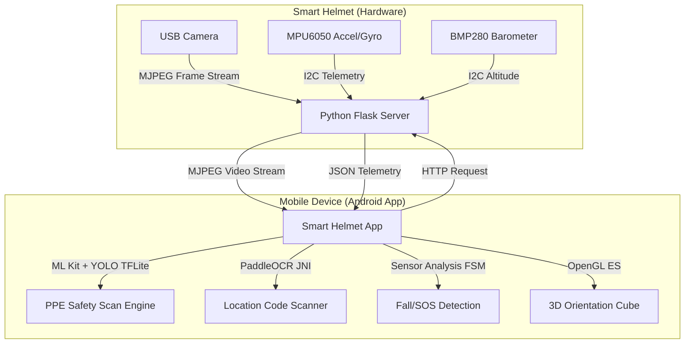

# Smart Helmet: IoT Safety Companion & HUD

A professional-grade IoT and Android-based smart helmet command center. The system is designed to improve industrial worker safety, monitor posture/falls, enforce PPE compliance using on-device computer vision, and coordinate real-time location mapping.

The system consists of two primary modules:
1. **Helmet Server (Python)**: Runs on an embedded single-board computer (Radxa Zero 3W) mounted on the helmet, interfacing with raw hardware sensors and a camera.
2. **Mobile Application (Android/Java)**: Acts as the worker HUD and processing engine, running real-time AI models on-device, handling alerts, and managing logs.

---

## System Architecture



---

## Industrial Use Cases & Hardware Mounting

This system is designed for high-risk industrial environments (such as construction sites, mining operations, oil rigs, and logistics warehouses) where worker safety, compliance, and real-time monitoring are critical.

### Physical Helmet Mounting
1. **Processing Unit (Radxa Zero 3W)**: The ultra-compact Radxa Zero 3W board is housed in a rugged, 3D-printed ABS enclosure mounted on the rear-back or inside the brim of the safety helmet to maintain balance and comfort.
2. **Camera Module**: A mini wide-angle USB camera is mounted on the front crown or visor of the helmet, capturing a first-person field of view matching the worker's gaze.
3. **Sensors (MPU6050 & BMP280)**: Mounted flat at the top-center of the helmet to accurately measure head pitch, roll, yaw, and relative barometric altitude changes.
4. **Power Supply**: A lightweight rechargeable Li-Po battery pack (with a 5V step-up regulator) is secured to the back of the helmet, providing portable power for the Radxa board and sensors.

### Key Industrial Applications
* **PPE Enforcement**: Prevents safety violations by scanning and logging worker gear before entering active hazard zones.
* **Fall & SOS Dispatch**: Automatically alerts emergency contacts with precise GPS coordinates if a worker falls from a height (e.g., scaffolding, ladders) and becomes unresponsive.
* **Proximity & Posture Monitoring**: Warns workers of hazardous posture (e.g., looking down continuously in head-strike zones) or sudden drops in height (barometric altitude tracking).
* **Location Logging**: Facilitates zone check-ins in warehouses or manufacturing bays by reading equipment/wall tags.

---

## Mobile App Tab Walkthrough & Use Cases

The Android application is organized into **7 dedicated tabs**, each serving a specific operational role:

### 1. Dashboard Tab
* **Use Case**: Everyday status check and connection management.
* **Description**: Serves as the central monitoring panel. Shows if the phone is linked to the helmet's Wi-Fi network and Bluetooth, displaying system status (e.g., "Ready", "Sensor link waiting") and device metadata.

### 2. Camera Tab
* **Use Case**: Direct inspection, video documentation, and local file storage.
* **Description**: Streams clean, high-framerate MJPEG video from the helmet camera. Enables the worker to take snapshots or start video recordings stored directly on the helmet's local filesystem. Includes a gallery viewer to download or delete recorded media files.

### 3. PPE Tab (AI compliance)
* **Use Case**: Pre-entry safety audits and site-compliance logging.
* **Description**: Gated by Google ML Kit Face/Object Detection, it initiates a mandatory 15-second scanning countdown once a worker is detected. Runs a custom YOLO TFLite model on-device to classify safety items (**Helmet, Vest, Mask, Gloves, Boots**). Dispatches Text-to-Speech (TTS) voice alerts for missing items and writes structured session logs.

### 4. Live Location Tab (PaddleOCR)
* **Use Case**: Zone tracking, inventory check-in, and automated dispatch.
* **Description**: Scans industrial location tags (alphanumeric codes like `A25-2E`) using the integrated **PaddleOCR Engine** (via C++ JNI). When a code is matched, the app automatically translates it into a physical location name and dispatches an SMS log to the safety coordinator.

### 5. IMU Tab
* **Use Case**: Telemetry diagnostics, sensor health checks, and 3D modeling.
* **Description**: Visualizes raw values from the MPU6050 accelerometer and gyroscope, temperature, and BMP280 altitude. Features a live-rendered 3D OpenGL ES cube that mirrors the helmet's actual orientation in real-time, plus calibration and CSV logging utilities.

### 6. Posture Tab
* **Use Case**: Fatigue tracking, ergonomics monitoring, and hazard warning.
* **Description**: Uses a Finite State Machine (FSM) to calculate head positions (LEVEL, LOOKING UP/DOWN, TILT), turn directions (LOOKING LEFT/RIGHT via Gyro Z integration), altitude changes, and head gestures (Nod, Head Shake). Houses the core SOS fall detection logic.

### 7. Connect Tab
* **Use Case**: System setup, device pairing, and emergency contacts.
* **Description**: Allows the user to configure the helmet's Host IP/Port, search and pair with Bluetooth SPP transceivers, and configure the emergency contact phone number for fall notifications.

---

## Directory Structure

* **`android_app/`**: The complete Android Studio project (Java).
  * `app/src/main/java/`: Main application code, including JNI wrappers, UI components, and sensor engines.
  * `app/src/main/assets/`: Embedded TFLite model files, PaddleLite neural networks, and dictionary assets.
  * `app/OpenCV/` & `app/PaddleLite/`: Precompiled native libraries and header dependencies.
* **`helmet_server/`**: The python-based embedded server meant to run on the helmet.
  * `helmet_server.py`: The Flask server hosting endpoints for video streaming, raw telemetry polling, and media recording.
  * `imu_stuff/`: Helper scripts for MPU6050 calibration, register diagnostics, and standalone readouts.

---

## Project Setup & Execution

### 1. Setting Up the Helmet Server (Radxa Zero 3W)
1. Copy the contents of the `helmet_server/` directory onto your Radxa Zero board.
2. Install system libraries and python packages:
   ```bash
   sudo apt-get update
   sudo apt-get install python3-pip python3-opencv i2c-tools ffmpeg -y
   pip3 install Flask smbus2
   ```
3. Ensure the I2C interface is enabled (check if `/dev/i2c-4` is accessible).
4. Run the Python server:
   ```bash
   python3 helmet_server.py
   ```
   *The server will start hosting endpoints on `http://0.0.0.0:5000`.*

### 2. Building the Android Application
1. Open the `android_app/` folder in **Android Studio**.
2. Make sure you have the Android NDK installed (`21.1.6352462` or compatible).
3. Connect your Android phone to your PC via USB and enable USB Debugging.
4. Build and install the app by clicking **Run** in Android Studio (or run `./gradlew assembleDebug` in the terminal to generate the APK).

### 3. Connecting App & Helmet
1. **Network Connection**:
   * **Wi-Fi Mode**: Connect both the phone and the Radxa Zero board to the same Wi-Fi network (or connect the Radxa board to your phone's Wi-Fi hotspot).
   * **USB Tethering Mode**: Connect the Radxa board to your phone via USB and enable USB Tethering in your phone's connection settings.
2. **Find Server IP**: Determine the IP address assigned to the Radxa board (e.g. run `ifconfig` on the board to check the IP on the `wlan0` or `usb0` interface).
3. **Configure the App**:
   * Launch the **Smart Helmet** app on your phone.
   * Navigate to the **Connect** tab.
   * Enter the Radxa's IP address (including port `:5000`, e.g., `192.168.42.129:5000`).
   * Click anywhere or switch tabs to save. Telemetry and video feeds will now populate in real-time.
